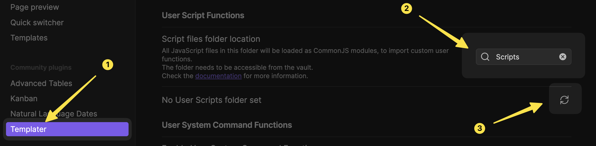
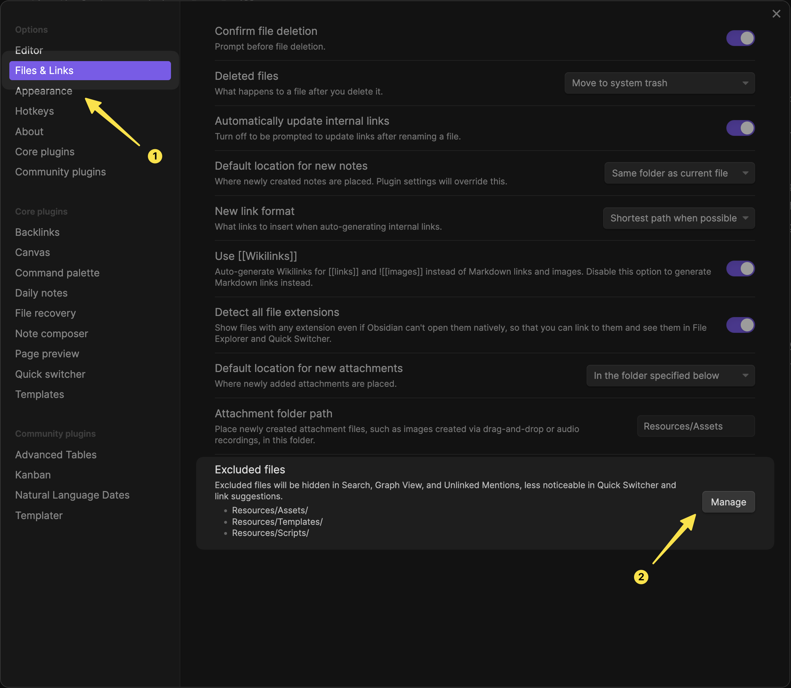

<h1 align="center" style="line-height: 2">
    <code>Templater</code> User Scripts <br>
    for <code>Obsidian</code>
    <br/>
</h1>

<!-- badges: start -->
<p align="center">
    <a href="https://www.repostatus.org/#active"></a>
    <a href="https://github.com/mihaiconstantin/obsidian-templater-scripts/releases"></a>
    <a href="https://github.com/mihaiconstantin/obsidian-templater-scripts/issues"></a>
    <a href="https://github.com/mihaiconstantin/obsidian-templater-scripts"></a>
</p>
<!-- badges: end -->

## ℹ️ Description

This repository contains opinionated, but convenient, [user scripts] built
around the [`Templater`] plugin for [`Obsidian`].

## ⬇️ Installation

### Prerequisites

The installation steps that follow below assume a couple of things:

1. You have an [`Obsidian`] vault.
2. You have already installed and enabled the [`Templater`] community plugin.
3. You correctly registered your templates folder in the [`Templater`] settings.

Depending on how you handle your vault, you can either use [`git`] to install
the user scripts in this repository, or you can manually download and place them
in your vault.

### The [`git`] way 💻

Add this repository as a [submodule] to your vault in a location of your choice.
Suppose you want to add the submodule to the `Scripts` directory in the root of
your vault. In a terminal, you need to do the following:

```bash
# Change directory to the root of your vault.
cd /path/to/your/vault

# Add this repository as a submodule to your vault.
git submodule add https://github.com/mihaiconstantin/obsidian-templater-scripts.git Scripts
```

At this point, you should have a `Scripts` directory in the root of your vault
that contains the contents of this repository.

*Note.* In most cases, after executing the `git submodule` command above [`git`]
will automatically download the contents of the repository in the `Scripts`
directory. However, if your [`git`] version is seriously outdated, you may need
to explicitly initialize the submodule by executing the following command:

```bash
# Download the submodule contents.
git submodule update --init --recursive
```

### The manual way 👀

Download a `.zip` archive of this repository, unpack it, and copy the contents
of the unpacked folder to a location of your choice in the [`Obsidian`] vault
(e.g., in the `Scripts` folder in the root of your vault).

### Registering the scripts ⚙️

The final step in the installation process is informing [`Templater`] about the
location of the `Scripts` folder. You may want to check [this
resource][templater-user-scripts] for more information. In a nutshell, you need
to indicate in the [`Templater`] settings where the `Scripts` folder is located,
as shown below:

<p align="center">
    
</p>

Additionally, you may also want to exclude this folder from the search results.
To do this, you need to add the `Scripts` folder to the list of excluded folders
in the [`Obsidian`] settings, as shown below:

<p align="center">
    
</p>

At this point, you are ready to start using the scripts in this repository in
your templates.

## 🚀 Features

This repository exposes several scripts to the [`Templater`] `tp` object. Each
of the scripts are available as a property of the `tp.user` object in the
context of a template. Below you can see a table with the available scripts and
a brief description. Check out the documentation for each script (i.e., via the
link) for more information and examples on how to use them.

| 🔗 User Script                                            | Description                                                                                                              |
| :------------------------------------------------------- | :------------------------------------------------------------------------------------------------------------------------ |
| [`prompt`](docs/prompt.md)                               | Prompts the user based on a configuration object.                                                                         |
| [`makeNote`](docs/makeNote.md)                           | Create a new note from template in a specified location, or insert a template at the cursor, without automated prompting. |
| [`makeNoteWithPrompting`](docs/makeNoteWithPrompting.md) | Create a new note from template in a specified location, or insert a template at the cursor, with automated prompting.    |

## Contributing

Any contributions, suggestions, or bug reports are welcome and greatly
appreciated. Please open an [issue] or submit a [pull request].

## ⚖️ License

This repository is licensed under the [MIT license](LICENSE).

[user scripts]: https://silentvoid13.github.io/Templater/user-functions/overview.html
[`Templater`]: https://silentvoid13.github.io/Templater/introduction.html
[`Obsidian`]: https://obsidian.md/
[`git`]: https://git-scm.com/
[submodule]: https://github.blog/2016-02-01-working-with-submodules/
[templater-user-scripts]: https://silentvoid13.github.io/Templater/user-functions/script-user-functions.html
[issue]: https://github.com/mihaiconstantin/obsidian-templater-scripts/issues
[pull request]: https://github.com/mihaiconstantin/obsidian-templater-scripts/pulls
